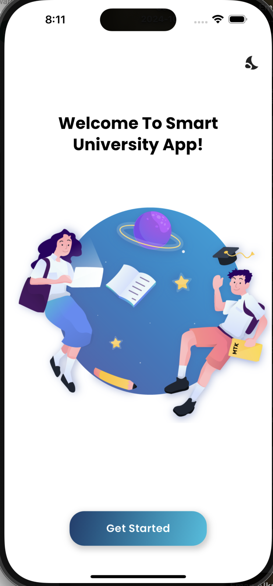
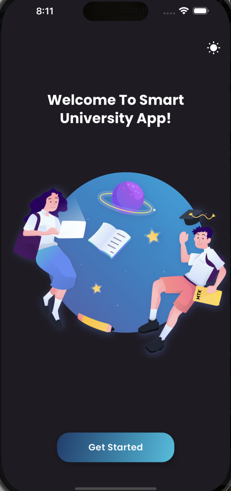
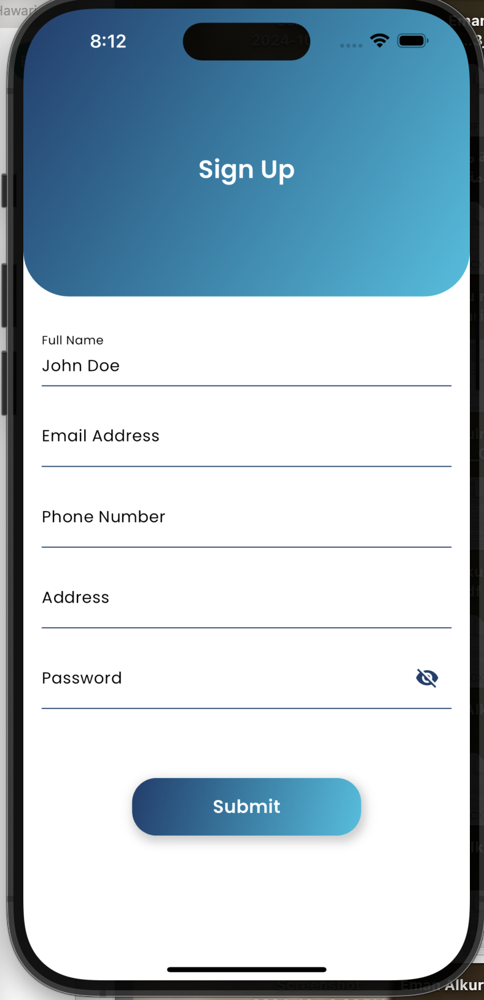
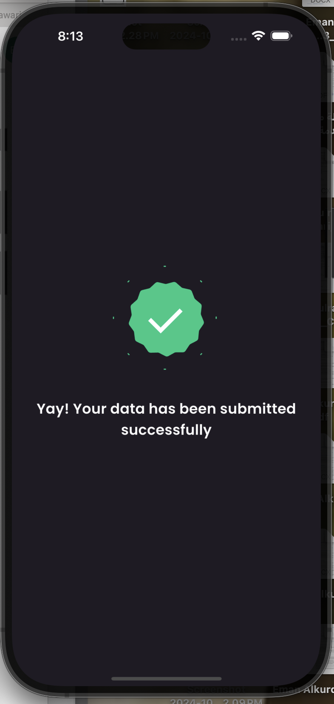

# Smart University

## Table of Contents
1. [Overview](#overview)
2. [Features](#features)
3. [Getting Started](#getting-started)
4. [Installation](#installation)
5. [Running the App](#running-the-app)
6. [State Management Overview](#state-management-overview)
7. [Live Preview](#live-preview)
8. [Download and Install the APK](#download-and-install-the-apk)
9. [Screenshots](#screenshots)
10. [Additional Notes](#additional-notes)
11. [Challenges Encountered](#challenges-encountered)

## Overview
This is a simple smart university app which contains welcome screen, Form to register user informations, confirmation screen after user submit his info, details screen to show user his data

**Example:**
> This app is designed to collect and display user information while allowing users to customize the app's appearance through theme settings. It offers a simple and user-friendly interface for users to input their details, view the submitted information, and toggle between light and dark modes. The app ensures a smooth user experience by providing clear navigation, intuitive form validation, and real-time updates using state management. The app features include:

- **User Profile Management**: Users can enter and view their personal information through a streamlined form interface.
- **Dynamic Theme Switching**: Supports both light and dark themes, allowing users to change the appearance of the app based on their preferences or system settings.
- **Reusable State Management**: Implements a generic BLoC pattern for efficient and reusable state management across different components of the app, ensuring smooth data handling and error management.
- **Reusable Components**: The app includes various reusable UI components, making it easy to maintain and extend the interface while promoting consistency across different screens.
- **Centralized Styling and Resources**: Adopts a centralized approach for managing reusable text styles, app strings, paddings, and other design constants. This ensures a consistent look and feel throughout the app and makes it easier to adjust global styles from a single location.
- **Clean Architecture with MVVM and Organized Widgets**: Each screen is structured into a dedicated folder containing `view`, `model_view`, and `model` files, following the MVVM (Model-View-ViewModel) pattern. Additionally, each screen folder includes a `widgets` subfolder for managing smaller UI components specific to that screen. This approach enhances code organization, maintainability, and modularity, making the app easier to scale and understand.

## Features

- **Home Screen**: Displays a welcome message and provides navigation options to access other screens within the app. By clicking "Get Started," the app navigates to the next screen, which is the Form Screen, It also includes a button to toggle between light and dark themes, allowing users to customize the app's appearance.
- **Form Screen**: Includes a form where users can input data and submit it. The form is designed for easy data entry and validation, with text fields for full name, email address, phone number, address, and password.
- **Confirmation Screen**: Shows a confirmation message with an animated shape, providing feedback to users that their data has been submitted successfully.
- **Details Screen**: Presents detailed information based on the user's inputs from the Form Screen.

## Getting Started
### Prerequisites
- **Flutter SDK**: Version 3.24.3 or higher. Make sure to have this version installed before running the app. You can download Flutter from the [official Flutter website](https://flutter.dev/docs/get-started/install).
- **Dart SDK**: Dart is included with the Flutter SDK, so a separate installation is not required.

### Installation
1. Clone the repository:
   ```bash
   git clone https://github.com/bakrabdulrahmanhawarieng/technical_test.git
   ```
2. Navigate to the project directory:
   ```bash
   cd technical_test
   ```
3. Install the required dependencies:
   ```bash
   flutter pub get
   ```


## Running the App
- To run the app on an emulator or physical device:
   ```bash
   flutter run
   ```
> **Note**: Make sure to have an emulator or a physical device connected to run the app.

## State Management Overview
> The app uses the BLoC (Business Logic Component) pattern for state management, utilizing the `flutter_bloc` package. This pattern helps in separating business logic from UI code, making the app more modular and testable.

- **UserCubit**: Manages user-related data, such as user details.
- **ThemeCubit**: Controls the application's theme, allowing users to switch between light and dark modes.
- **GenericBloc**: A reusable generic BLoC that handles various types of data, allowing the same logic to be applied across different parts of the app.

## Code Architecture

The app follows a modular code architecture to maintain clean and organized code. Below is an overview of the folder structure:

```
technical_test/
├── lib/
│   ├── presentation/          # Contains the UI components and screens
│   │   ├── home/              # Home screen folder
│   │   │   ├── view/          # UI widgets for Home screen
│   │   │   ├── view_model/    # Logic connecting UI with data for Home
│   │   │   ├── imports/       # Imports of dependencies used in the screen and view model
│   │   │   ├── widgets/       # Reusable UI components for Home screen
│   │   ├── form/              # Form screen folder
│   │   │   ├── view/
│   │   │   ├── view_model/
│   │   │   ├── imports/      
│   │   │   ├── widgets/
│   │   ├── confirmation/      # Confirmation screen folder
│   │   │   ├── view/
│   │   │   ├── view_model/
│   │   │   ├── imports/      
│   │   │   ├── widgets/
│   │   ├── details/           # Details screen folder
│   │   │   ├── view/
│   │   │   ├── view_model/
│   │   │   ├── imports/      
│   │   │   ├── widgets/
│   ├── core/                  # Core functionalities
│   │   ├── constants/         # App strings, dimensions, and styles
│   │   ├── theme/             # Light and dark theme management
│   │   ├── routes/            # Handles app navigation and routing
│   │   ├── utils/             # Contains reusable functions or validators
│   ├── blocs/                 # State management logic using BLoCs and Cubits
│   │   ├── theme_cubit/       # Manages theme state
│   │   ├── user_cubit/        # Manages user data state
│   │   ├── generic_bloc/      # Reusable generic BLoC for various data types
│   ├── data/                  # Manages data models, repositories, and data sources. 
│   │   ├── models/            # Contains the data models used throughout the app,
├── assets/                    # Contains images, animations, etc.
├── README.md                  # Project documentation
```

- **presentation**: Contains the UI components of the app, including screens and widgets. Each screen is further divided into subfolders for better organization.
- **core**: Holds reusable constants, theme configurations, and routing logic.
- **blocs**: Contains the state management logic for the app, organized by feature.
- **assets**: Stores images, animations, and other static assets.

This structure promotes separation of concerns and makes the codebase easier to scale and maintain, adhering to clean architecture principles.
## Live Preview
You can try out the app using the live preview link below:
[Live Preview URL](https://tech.bakrhw.com)

## Download and Install the APK

To install the app on your Android device, you can download the pre-built APK file and install it directly:

1. **Download the APK**:
   - Click the link below to download the APK file:
     [Download APK](https://github.com/bakrabdulrahmanhawarieng/technical_test/blob/main/smart_university.apk)

2. **Install the APK**:
   - Once the APK is downloaded, open it on your Android device.
   - You may need to enable **Install from Unknown Sources** in your device settings if prompted.
   - Follow the on-screen instructions to complete the installation.

> **Note**: Make sure to enable **Install from Unknown Sources** in your device’s security settings if you encounter any issues while installing the APK.

## Screenshots

| Home Screen | Home Screen (Dark Theme) | Form Screen | Confirmation Screen (Dark Theme) |
|:-----------:|:-----------------------:|:-----------:|:-------------------------------:|
|  |  |  |  |


## Additional Notes
> - **Theme Handling**: The app defaults to the system theme mode but allows users to switch between light and dark themes using the `ThemeCubit`.
> - **Screen Size Adaptation**: The `flutter_screenutil` package is used for adapting the UI to different screen sizes, ensuring a responsive layout across various devices.
> - **Routing**: The app uses `auto_route` for managing routes, providing a more declarative approach to defining navigation.

## Challenges Encountered
> - **Challenge 1**: Integrating the `auto_route` package with the existing navigation structure.
>   - **Solution**: Followed the package documentation and adjusted the router configuration to fit the app's navigation needs.
> - **Challenge 2**: Managing the state across multiple Cubits while ensuring a clean architecture.
>   - **Solution**: Utilized the `MultiBlocProvider` to provide all necessary Cubits in the widget tree, making state management more consistent.
> - **Challenge 3**: Adapting the UI for different screen sizes.
>   - **Solution**: Used the `flutter_screenutil` package for screen adaptation, ensuring consistent UI scaling.
